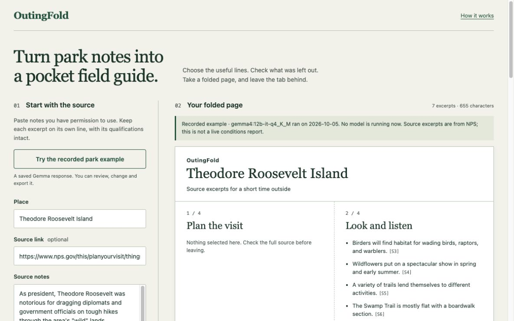

# OutingFold

Turn park notes into a pocket field guide. Local Gemma chooses whole source excerpts; you review what it selected **and what it left out**, then save an offline page or print a card.

[Try the recorded example](https://hyunsikparker.github.io/outingfold/)



The hosted demo replays a saved, real Gemma response. It also lets you arrange your own notes manually. It does not run a hosted model or connect to your local Ollama. For live inference, run the app locally.

## Run locally

You need Node.js 22 or later and [Ollama](https://ollama.com/). The tested model download is roughly 8 GB; leave enough memory for both the model and its context. The recorded run used an Apple M4 with 32 GB RAM and Ollama 0.35.1. Smaller machines have not been tested.

```sh
git clone https://github.com/HyunsikParker/outingfold.git
cd outingfold
ollama pull gemma4:12b-it-q4_K_M
# Start Ollama if it is not already running: ollama serve
npm start
```

Open `http://127.0.0.1:4318`. There are no npm dependencies to install. Once the model is downloaded, inference uses the local Ollama instance. No API key is required.

Paste source excerpts one per line, preserving qualifications and exceptions. Select with Gemma, review every source line, correct the selection or section, and tick the review confirmation. Save the offline HTML, print the card, or export the complete source record as JSON. Check your print preview; paper size, fonts and unusually long words can affect pagination.

`OUTINGFOLD_OLLAMA` can select a different loopback HTTP endpoint; it defaults to `http://127.0.0.1:11434`. `PORT` defaults to `4318`. The server binds to `127.0.0.1`.

## What the model does

Gemma returns source IDs and one of three sections: `plan`, `notice`, or `care`. Application code rejects unknown or duplicate IDs and unexpected fields, then copies the original substrings. Generated prose never becomes card text.

This prevents invented quotations, **not omissions or misleading selections**. A qualification on a different line can still be missed. The review lists every source line, including unchecked ones. The offline file retains the full pasted notes; the printed card contains only selected excerpts. Empty sections say that nothing was selected, not that no restrictions exist. Editing the source or selection resets review confirmation.

There are limits of 16,000 input characters, 120 source lines, 12 selected excerpts, 1,800 selected characters overall, and 800 per section. Exceeding an output limit blocks export until the selection is reduced. An empty model result offers manual selection. Errors do not silently produce a substitute model answer.

## Measured results and limits

The [recorded evaluation](evidence/report.json) completed three predeclared cases on October 5, 2026. It stopped at the first selection failure.

| Case | Result | Request time |
| --- | --- | --- |
| NPS park excerpts | Required selections retained | 8.533 s |
| Synthetic closure and exception | Required selections retained, including both parts of a qualification | 10.835 s |
| Sparse observation notes | Failed: empty selection, two relevant lines missed | 3.490 s |

All completed outputs passed exact-source checks; the empty result passed that check vacuously. Two of three cases passed the selection criteria. A fourth, prompt-injection case was planned but was not run after the failure. These few fixtures do not estimate general accuracy or establish prompt-injection resistance. One earlier request was cancelled without a result before this recorded run.

The saved example uses the first result unchanged. Raw responses, source inputs and expected selections are in `evidence/` and `scripts/cases.json`. The exact tested model digest was `4eb23ef187e2c5462566d6a1d3bbbc2f1346d0b4327cbb66d58fffbcc9b2b05c`; the named Ollama tag can change.

```sh
npm test
```

The nine software tests cover source copying, selection validation, output limits, offline escaping, omitted-source retention, and local API boundaries using a mock model. They require no inference or network service. `node scripts/evaluate.mjs` runs the separate model evaluation, consumes local compute, and is expected to exit nonzero if any criterion fails. It is not part of `npm test`.

Browser checks covered adding an omitted excerpt, changing sections, review-gated exports, downloading and opening the offline HTML, keyboard focus, a 390 px viewport, and a one-page A4 PDF of the example. There has been no outdoor field trial or physical print test.

## Data and security

The app has no accounts, analytics, location access or persistent browser storage. Notes stay in page memory until exported. Local inference sends them to the local Node server and local Ollama. Static hosting still receives ordinary page requests. Following a source link opens that external website.

The server accepts only a loopback Ollama endpoint, checks request host and origin, limits request bodies and concurrency, and does not fetch source URLs. Offline exports escape source text and contain no scripts or external assets. These controls do not verify the source's truth, currency or completeness. Recheck opening hours, closures, weather and access before leaving. This is a reading aid, not navigation or a conditions service.

## Credits and license

Created during the [Hacktoberfest Open-Source AI Challenge Week 1](https://dev.to/challenges/hacktoberfest-week1-2026-10-05), beginning October 5, 2026. Code and documentation were developed with OpenAI Codex assistance. The running selection feature uses Google's open-weight Gemma through Ollama. No model weights are included.

Original application code: [MIT](LICENSE). Example excerpts: [National Park Service, Theodore Roosevelt Island — Things To Do](https://www.nps.gov/this/planyourvisit/things2do.htm), retrieved October 5, 2026. The example contains nine selected source excerpts, not the entire NPS page. No claim to original U.S. Government works. See [third-party notices](THIRD_PARTY.md).

Post-deadline changes: none as of this initial release. Changes after the challenge deadline will be identified here.
